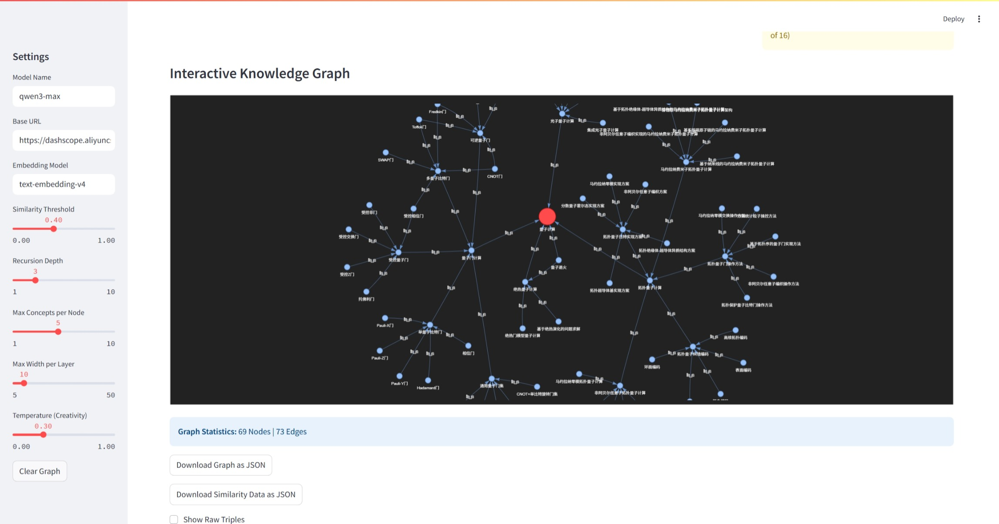

# 🌌 LLM-Cosmos

> 输入任意一个词，AI 自动展开它的知识宇宙。
>
> 每个概念都会生长出与它相关的子概念，子概念再继续扩展——
> 直到你面前出现一张完整的、可交互的知识图谱。

  

---

## 它是什么感觉

输入 `"量子计算"` ，几秒钟后：

```
量子计算
├── 基于 ──▶ 量子叠加态
│            └── 利用 ──▶ 量子比特
├── 应用于 ──▶ 密码学
│              └── 威胁 ──▶ RSA加密
├── 需要 ──▶ 量子纠错
└── 竞争者 ──▶ 经典计算机
               └── 优势在 ──▶ 稳定性
```

每一条关系都是 AI 实时生成的三元组（主体 → 关系 → 客体），逐层扩展，最终呈现为一张你可以点击、拖拽、缩放的交互式图谱。

适合：**快速理解新领域 · 研究前的概念地图 · 写作前的头脑风暴 · 教学辅助**

---

## 效果演示

启动后在浏览器里操作：

1. 左侧输入框填入种子概念（可以是任何词：一个学科、一个人名、一个事件）
2. 点击 Generate，图谱开始实时生长
3. 点击任意节点，可以继续向该方向深挖
4. 调整深度和宽度，控制图谱规模


---

## 快速开始

**环境：Python 3.10+，一个本地或远端的 OpenAI 兼容模型**

```bash
git clone https://github.com/liftkkkk/LLM-Cosmos
cd LLM-Cosmos
pip install -r requirements.txt
python main.py
```

浏览器会自动打开 Streamlit 界面。

**默认配置使用本地 Ollama：**

```
Base URL:        http://localhost:11434/v1
Chat Model:      gemma3:1b
Embedding Model: qwen3-embedding:0.6b
```

如果你用的是其他服务（OpenAI、SiliconFlow、DeepSeek 等），在左侧 Settings 里改 Base URL 和 Model Name 即可，不需要动代码。

---

## 模型选择建议

| 场景 | 推荐模型 | 说明 |
|------|---------|------|
| 本地运行，免费 | Ollama + gemma3 / qwen3 | 需要本地 GPU，效果够用 |
| 云端，国内访问 | SiliconFlow API | 有免费额度，兼容 OpenAI 格式 |
| 最佳效果 | GPT-4o / Claude 3.5 | 三元组质量最高，图谱更准确 |

任何支持 OpenAI Chat Completions 格式的模型都可以接入。

---

## 核心参数

在 Streamlit 左侧 Settings 面板可以调整：

| 参数 | 说明 | 建议值 |
|------|------|--------|
| Recursion Depth | 扩展层数，越深图谱越大 | 2-3 层（层数翻倍节点数指数增长） |
| Max Concepts per Node | 每个节点生成几条三元组 | 3-5 |
| Max Width per Layer | 每层处理多少个节点（BFS 宽度） | 5-10 |
| Similarity Threshold | 相似度剪枝阈值，越高越聚焦 | 0.5-0.7 |
| Temperature | 生成随机性，越高越发散 | 0.3-0.7 |

**第一次用建议：** Depth=2，Max Concepts=3，这样几十秒出图，不会等太久。

---

## 导出图谱

生成完成后可以导出：

- `knowledge_graph.json` — NetworkX Node-Link 格式，可导入其他图分析工具
- `similarity_scores.json` — 每个节点相对种子概念的语义相似度

---

## 项目结构

```
LLM-Cosmos/
├── main.py              # 启动入口
├── core/
│   └── extractor.py     # LLM 三元组抽取 + embedding 相似度计算
├── schema/
│   └── models.py        # Pydantic 数据结构（Triple / KnowledgeGraph）
├── viz/
│   └── app.py           # Streamlit 可视化界面
└── requirements.txt
```

---

## 它和思维导图工具有什么区别

思维导图是你自己想，然后手动填。

LLM-Cosmos 是你给一个起点，AI 帮你把你还没想到的关联全部展开——包括你可能不知道的跨领域连接。

本质上它是 **AI 驱动的概念探索**，而不是整理工具。

---

## Roadmap

- [ ] 支持中文种子概念优化（当前中英文均可用，中文效果因模型而异）
- [ ] 点击节点原地继续扩展（无需重新生成全图）
- [ ] 图谱历史记录与对比
- [ ] 导出为 Markdown 大纲格式

---

## License

MIT — 随便用，欢迎 PR 和 Issue。

觉得有意思的话，给个 ⭐ 让更多人发现它。
